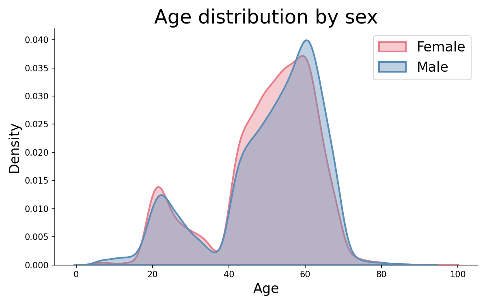
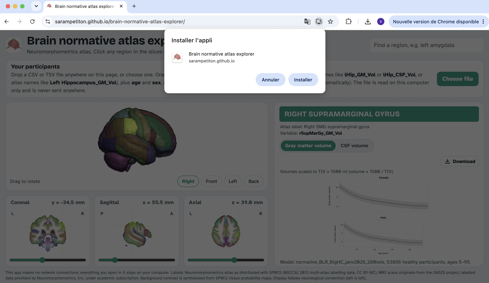
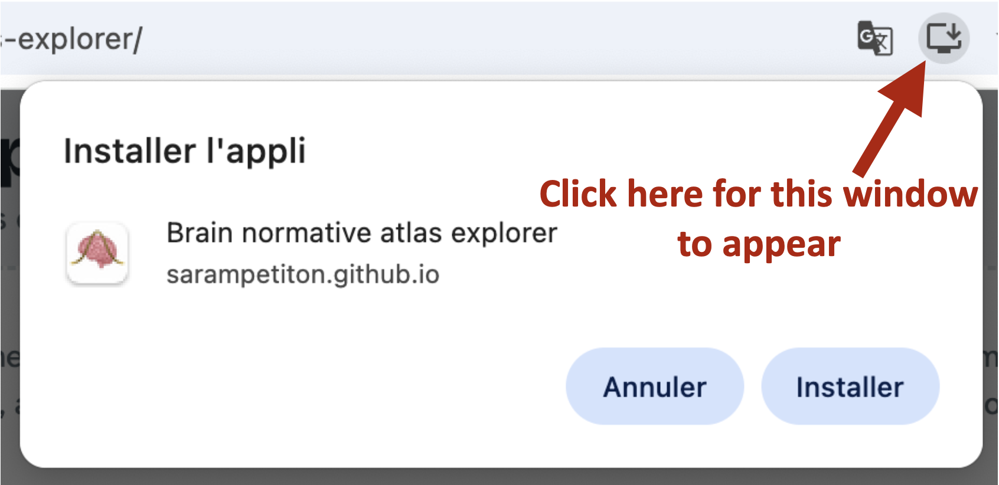

# Neuromorphometrics brain normative atlas explorer

Installable web app: click a region of the Neuromorphometrics atlas and its name appears with the corresponding normative charts (gray matter or CSF volume by age, for females and males; a switch above the charts selects the tissue). You can also open a CSV file of your own participants to see where they fall on the charts, provided the file contains regions from the Neuromorphometrics atlas using CAT 12.7. If volume values are scaled by TIV, they should be scaled such that the TIV equals 1500 ml, otherwise, a "TIV" column should be included, with each participant's tiv value.
Regions without a normative chart show a smiley instead :smiley: :brain: (who knew markdown enabled smileys??).

## Author and acknowledgements

Developed by Sara Petiton. I trained the normative models during my PhD at Université
Paris-Saclay, using NeuroSpin (CEA) computing resources, in the Signatures team of the GAIA lab,
where I worked under the direction of Edouard Duchesnay and the co-supervision of Antoine Grigis.

## Data the normative model was trained on

The normative model was trained on 53,856 healthy participants aggregated from four sources:

|                 | Total       | OpenBHB     | UK Biobank | OpenNeuro   | HCP        |
|-----------------|-------------|-------------|------------|-------------|------------|
| N               | 53,856      | 6,247       | 42,923     | 3,573       | 1,113      |
| Age (mean ± SD) | 50.2 ± 13.8 | 33.9 ± 18.4 | 55.0 ± 7.5 | 28.0 ± 13.7 | 28.8 ± 3.7 |
| Female (%)      | 52.9%       | 51.8%       | 52.7%      | 56.4%       | 54.4%      |

The age distribution is bimodal (a smaller peak in the early twenties, mostly OpenBHB, OpenNeuro and HCP, and a large peak between about 40 and 70, mostly UK Biobank), so the curves are best constrained in those age ranges. They describe poorly childhood, ages between about 35 and 40, and ages above 75. Access to datasets representing these ages well would greatly benefit the accuracy of the model.

Regional gray matter and CSF volumes were extracted with CAT12 using the Neuromorphometrics atlas (CAT12 12.7 for UK Biobank and OpenNeuro, 12.6 for HCP) and scaled to TIV = 1500 ml (see "Head size" below). The model (`NormativeBLR`) fits one Bayesian ridge regression per region, with age (cubic B-splines) and sex as covariates and a sinh-arcsinh warping of the volumes; the SD of each chart is the SD of the residuals in volume units.

  
   
  <em>Age distribution of the 53,856 healthy participants, by sex.</em>

## Normative model

The charts are drawn from `normative_model.js`, which contains, for each region (gray matter and CSF) and each sex, the normative mean curve over the training age range and the standard deviation. They are computed as in the analysis code: mean = `model.predict()` for females and males across ages, band = mean ± `model.stds_` for that region.

The charts are drawn from `normative_model.js`, which contains the curves of the normative model
described above, exported from the model pickle by `export_normative_model.py`.

`normative_model_demo.js` contains **synthetic curves**, for testing the app without the real model.
The app does not use it as is: to try it, rename it to `normative_model.js` (keep a copy of the real
model you're using). The app then shows a yellow "demo curves" warning (the js file contains a flag indicating
it's a demo, regardless of the js file name).

To export the curves again (for example after retraining the model):

1. Put these files in this folder (next to `index.html`): the model pickle
   `normative_BLR_BigHC_janv2026_280rois.pkl`, `normative_models.py` (the `NormativeBLR` class,
   needed to load the pickle), and `regions_neuromorphometrics_cat12_7.csv` (the 280 ROI names,
   140 GM then 140 CSF, in the model's output order). Another model can be used if it is a fitted
   `NormativeBLR` (see `normative_models.py`) with the same 280 ROIs; if its file has another name,
   change `MODEL_NAME` at the top of `export_normative_model.py`.
2. Run `python3 export_normative_model.py` (from any directory). Before exporting, it checks the ROI
   order against the model's own predictions (region sizes, age trends, left/right symmetry) and
   stops if they do not match. The training age range is read from the model itself (its age
   splines span the training ages), so the training data are not needed.
3. It writes `normative_model.js` in this folder, replacing the previous one.

The exported file contains only the curves and standard deviations, no participant data and no model weights.

## Head size: volumes scaled to TIV = 1500 ml

The normative model was trained on volumes scaled to a total intracranial volume (TIV) of 1500 ml: for each participant, every GM and CSF volume was multiplied by 1500 / TIV (proportional scaling; 1500 ml is close to the average TIV of a mixed-sex adult sample). Participant volumes must be on the same scale to be compared with the charts, which state this convention above the plots.

- If your file has a **TIV** column (in ml, as output by CAT12; also recognised: `tiv`, `eTIV`, `ICV`), the app scales the volumes itself (× 1500 / TIV) and says so. You can therefore load raw CAT12 volumes.
- Without a TIV column, the volumes are assumed to be already scaled to TIV = 1500 ml.
- If the TIV values look implausible (for example in litres rather than ml), the app does not scale and shows a warning. Participants without a TIV value are not plotted (when the csv had a tiv column).

The downloaded z-scores are computed from the scaled volumes; when the file had a TIV column, the raw TIV is included as `TIV_raw`.

## Your participants (CSV or TSV file)

Drop a file anywhere on the page, or use "Choose file". Expected format: one row per participant, with

- **region columns**, in any order, named either with CAT12 short names (`lHip_GM_Vol`, `lHip_CSF_Vol`) or atlas names (`Left Hippocampus_GM_Vol`, `Left Hippocampus_CSF_Vol`). Columns without a tissue suffix (`Left Hippocampus`) are read as gray matter; white matter columns are ignored;
- **age** (in years) and **sex** (`female`/`male`, `F`/`M`, or numbers: the app then asks how they are coded);
- optionally **participant_id** (or `subject`, `id`), **session**, and **TIV** (see above);
- optionally **group**: up to 4 different values (text, numbers, or true/false). Participants are then coloured by group (green, orange, blue, yellow: the Okabe-Ito colour-blind-safe palette), and LOWESS curves are drawn per group. Participants with an empty group value are shown in grey.

Commas, semicolons and tabs are accepted, as well as decimal commas in semicolon-separated files. The app reports how many regions it recognised and lists any columns it ignored.

For each participant, the table under the charts shows the distance from the normative mean in z-scores (SD units), computed as (volume − mean) / SD, as drawn in the plots. This is the same z-score as `NormativeBLR.predict(..., return_zscores=True)`, since the model's SD (`stds_`) is computed from residuals in volume units (up to the interpolation between the exported ages, below 0.01 SD).

**LOWESS curves.** Tick "Show LOWESS curves" to draw a LOWESS curve per group (or one for all participants without a group column), in each chart. The smoothing slider sets `frac` (default 0.6, as in the analysis script). The implementation reproduces `statsmodels.nonparametric.smoothers_lowess.lowess` (3 robustness iterations); as in the analysis script, a curve is drawn only when a group has at least 4 participants in that chart.

**Downloads.** The download button above the charts saves the current region's charts as PNG or SVG, and the z-scores of all participants for all regions and both tissues as a CSV file (same (volume − mean) / SD definition). Files are created in the browser and saved directly to your computer.

The `examples/` folder contains **synthetic** test files (see `examples/README.md`): 4 participants, 8 participants in two groups, and the same 8 with raw volumes and a TIV column to test the automatic scaling. They are drawn from the normative model by `examples/make_synthetic_data.py`, which loads the model pickle and calls `model.predict()`: each volume is the normative mean for the participant's age and sex plus a deviation in z-scores (SD units). Regenerate them from the `examples/` folder. By default, the script uses the model pickle, `normative_models.py` and `regions_neuromorphometrics_cat12_7.csv` in the app folder, so no options are needed. To use other
files, either edit the paths at the top of the script, or give them as options (`--pkl`,`--module-dir`, `--roi-order-csv`).

    python3 make_synthetic_data.py → to generate 4 participants: 2 females and 2 males.
    python3 make_synthetic_data.py --preset groups → to generate synthetic data with participant groups.
    python3 make_synthetic_data.py --preset groups --raw → to generate synthetic data with participant groups and unscaled tiv (that the app with scale automatically)

## Privacy: your data stays on your computer

This app is designed for use with sensitive data.

- **No server, no uploads.** The app is a set of static files. Any file you open in it is read by your browser, in memory, on your own computer, and is never sent anywhere.
- **Enforced by the browser.** A security line (Content-Security-Policy) at the top of `index.html` tells the browser to block every network connection from the page. The only files the page may load are the app's own files (`normative_model.js`, icons), and only when it starts, before any data is opened. Fonts, images and the atlas are included in the app, so it needs nothing from the internet.
- **Nothing is saved.** Data you open is forgotten when you close the app.

To check this yourself: load the app, switch off your internet connection, and open your file. It works fully offline. You can also open your browser's developer tools (F12), go to the Network tab and confirm that no request is made when you open a file.

Recommendations for sensitive data:

- For the strictest settings, use a downloaded copy of this folder on the computer where the data is stored (see "Run locally") rather than a hosted version, so the code cannot change without you knowing.
- Use a browser profile without extensions, since some browser extensions can read the content of web pages.

## Run locally

    cd brain-normative-atlas-explorer
    python3 -m http.server 8000

Open http://localhost:8000. This works without an internet connection, and the app can be installed from there. Opening `index.html` directly (double-click) also works, without any server or internet connection.
Installing the app, and keeping an offline copy of the installed app, need it to be served over http(s): with the local server above (`localhost`) or from GitHub Pages.

## Install as an app (with the cute brain icon)

Open the address https://sarampetiton.github.io/brain-normative-atlas-explorer/ in Chrome or Edge and choose "Install app" (icon in the address bar, or the browser menu). On iPhone, open it in Safari and use Share > Add to Home Screen.

  

  

Installed copies use the latest files whenever they are online (for example after you replace `normative_model.js`), and their saved copy when offline.

## Files

- `index.html`: the whole app (code, atlas data, fonts and images are included in this file)
- `normative_model.js`: the normative curves (demo file until replaced, see "Normative model")
- `export_normative_model.py`: creates `normative_model.js` from the model pickle
- `normative_models.py`: the `NormativeBLR` class, needed to load the model pickle
- `normative_BLR_BigHC_janv2026_280rois.pkl`: the trained normative model (not used by the app itself, only by the scripts)
- `regions_neuromorphometrics_cat12_7.csv`: the 280 ROI names in the model's output order
- `examples/`: synthetic participant files for testing, and the script that generates them
- `manifest.webmanifest`: app name, icon and colours used when installing
- `sw.js`: saves a copy of the app on the device for offline use
- `icons/`: app icons
- `atlas/`: original atlas files, for reference (the app does not read them)

## Data and credits

### References

- Fraza, C. J., Dinga, R., Beckmann, C. F., & Marquand, A. F. (2021). Warped Bayesian linear
  regression for normative modelling of big data. *NeuroImage*, 245, 118715.
  https://doi.org/10.1016/j.neuroimage.2021.118715

### Atlas

`labels_Neuromorphometrics.nii` and `labels_Neuromorphometrics.xml` from SPM12, in the `tpm/` folder of the SPM12 repository ([spm/spm12](https://github.com/spm/spm12/tree/main/tpm), also mirrored at [neurodebian/spm12](https://github.com/neurodebian/spm12/tree/master/tpm)). 121x145x121 voxels, 1.5 mm, MNI space.

Region names follow the CAT12-style dictionary: the `l`/`r` prefix gives the hemisphere (left/right) `_GM_Vol` denotes gray matter volume and `_CSF_Vol` CSF volume. Labels with both hemispheres in a single atlas label (ventricles, brainstem, CSF, cerebellar vermis, optic chiasm) are split at the midline (x = 0 mm).

The labels are maximum probability tissue labels derived from the MICCAI 2012 Grand Challenge and Workshop on Multi-Atlas Labeling. Licence: CC BY-NC. MRI scans originate from the OASIS project (https://www.oasis-brains.org/), and the labelled data are "provided by Neuromorphometrics, Inc. (http://Neuromorphometrics.com/) under academic subscription".

### Background image

The grey background in the slice views is synthesised from the SPM12 tissue probability maps (`TPM.nii`, same `tpm/` folder). SPM12 is distributed under the GNU General Public License.

### Fonts

Bricolage Grotesque and Atkinson Hyperlegible, both under the SIL Open Font License 1.1, included in `index.html`.

#### Development

The web app (interface, visualisation and helper scripts) was developed with the assistance of
Claude (Anthropic). Any of the app's code generated by Claude was thoroughly reviewed and often annotated by me (SP). 
The normative models, training data and scientific choices are mine.